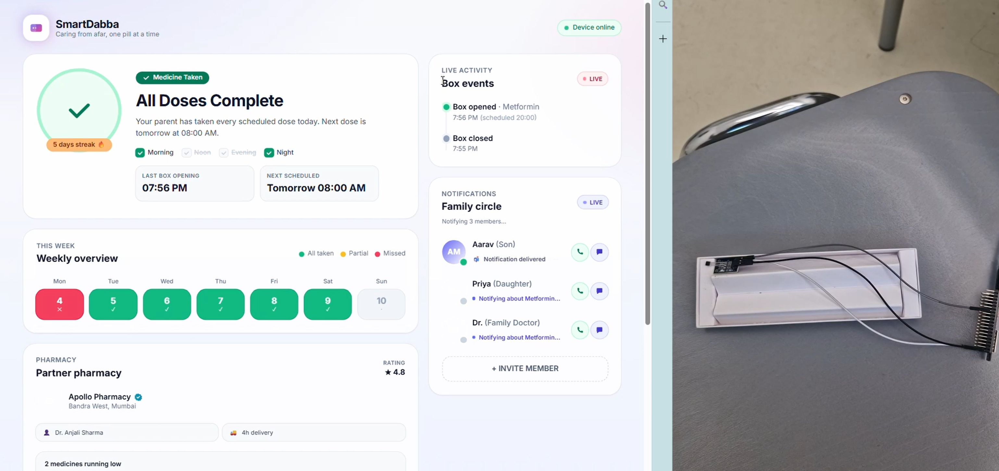

# SmartDabba

A real-time dashboard for a smart pill box. An ESP32 with a hall sensor watches the
lid; when the magnet moves away (lid opened) it pings the backend, which fans the
event out over WebSockets to every connected child / family dashboard.

## Demo



## Stack

- **Frontend**: React + Vite + Tailwind
- **Backend**: Node.js + Express + `ws`
- **Realtime**: WebSockets (`/ws`)
- **Storage**: in-memory (resets on server restart)

## Project layout

```
SmartPillBox/
├── backend/
│   ├── package.json
│   └── server.js          # Express + WebSocket + /api/sensor
└── frontend/
    ├── package.json
    ├── index.html
    ├── vite.config.js     # proxies /api and /ws to :4000
    ├── tailwind.config.js
    ├── postcss.config.js
    └── src/
        ├── main.jsx
        ├── App.jsx
        ├── index.css
        ├── useDabbaSocket.js
        └── components/
            ├── Header.jsx
            ├── StatusPanel.jsx
            ├── ActivityFeed.jsx
            ├── WeeklyGrid.jsx
            ├── FamilyPanel.jsx
            ├── MedicineInventory.jsx
            ├── PharmacyCard.jsx
            └── TodaySchedule.jsx
```

## Run it

Open two terminals.

### 1. Backend

```bash
cd backend
npm install
npm run dev
# → http://localhost:4000
# → ws://localhost:4000/ws
```

### 2. Frontend

```bash
cd frontend
npm install
npm run dev
# → http://localhost:5173
```

The Vite dev server proxies `/api/*` and `/ws` to the backend, so the same code
works in development and when served behind a single host in production.

## Backend API

| Method | Path            | Body                                    | Notes                                                       |
| ------ | --------------- | --------------------------------------- | ----------------------------------------------------------- |
| GET    | `/api/state`    | —                                       | Full snapshot (status, events, week, family)                |
| GET    | `/api/health`   | —                                       | Health check                                                |
| POST   | `/api/sensor`   | `{ "status": "opened" \| "closed" }`    | **ESP32 hits this.** Records event + broadcasts via WS      |
| POST   | `/api/simulate` | `{ "status": "opened" \| "closed" }`    | Same as `/api/sensor`, useful for the in-UI buttons         |
| POST   | `/api/reorder`  | `{ "medicationId": "...", "quantity": N }` | Triggers a pharmacy reorder for a medication            |

WebSocket messages from the server look like:

```json
{ "kind": "snapshot", "state": { ... } }
{ "kind": "event", "event": { ... }, "state": { ... } }
```

- `snapshot` is sent on connect.
- `event` is sent on every sensor event.

## ESP32 sample code (Arduino / hall sensor)

Replace SSID / password / server URL.

```cpp
#include <WiFi.h>
#include <HTTPClient.h>

const char* WIFI_SSID = "YOUR_WIFI";
const char* WIFI_PASS = "YOUR_PASSWORD";
const char* SERVER    = "http://192.168.1.50:4000/api/sensor";

const int HALL_PIN = 4;       // digital pin connected to A3144 OUT
int lastState = HIGH;         // HIGH = magnet near (lid closed) for A3144

void postStatus(const char* status) {
  if (WiFi.status() != WL_CONNECTED) return;
  HTTPClient http;
  http.begin(SERVER);
  http.addHeader("Content-Type", "application/json");
  String body = String("{\"status\":\"") + status + "\"}";
  http.POST(body);
  http.end();
}

void setup() {
  Serial.begin(115200);
  pinMode(HALL_PIN, INPUT_PULLUP);
  WiFi.begin(WIFI_SSID, WIFI_PASS);
  while (WiFi.status() != WL_CONNECTED) { delay(300); Serial.print('.'); }
  Serial.println("\nWiFi up");
}

void loop() {
  int state = digitalRead(HALL_PIN);
  if (state != lastState) {
    delay(30); // debounce
    state = digitalRead(HALL_PIN);
    if (state != lastState) {
      // magnet moved away → lid opened
      postStatus(state == HIGH ? "closed" : "opened");
      lastState = state;
    }
  }
  delay(20);
}
```

## Try it without an ESP32

The dashboard has **Simulate: lid opened / closed** buttons in the status panel —
they POST to `/api/simulate` and exercise the same code path the real device uses.

You can also curl it directly:

```bash
curl -X POST http://localhost:4000/api/sensor \
  -H "Content-Type: application/json" \
  -d '{"status":"opened"}'
```

Every connected dashboard tab will update in real time.
